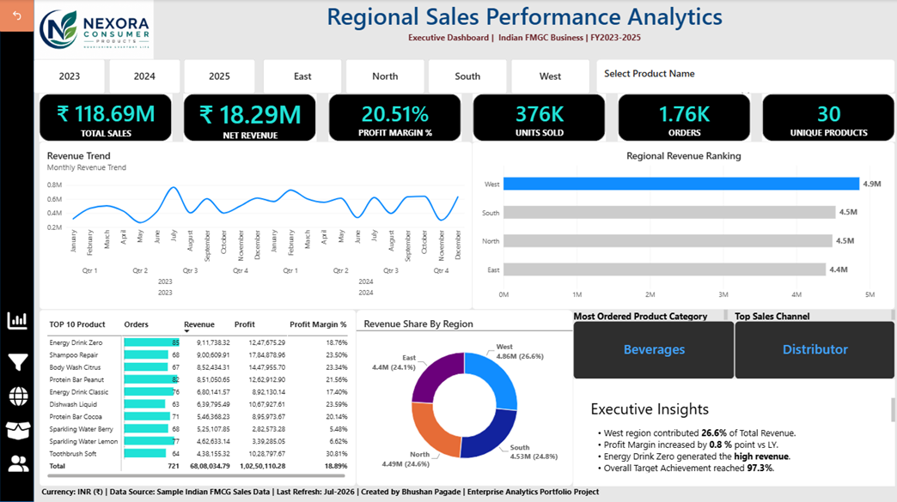

# 📊 Regional Sales Performance Analytics

## Executive Power BI Dashboard | Indian FMCG Business

> An Executive Sales Performance Dashboard developed using **Microsoft Power BI** to help Sales Directors and Regional Managers monitor business performance, identify growth opportunities, and support data-driven decision-making.

---

# 📷 Dashboard Preview



---

# 🎯 Business Problem

Sales leadership often struggles to obtain a consolidated view of regional performance across multiple locations and product categories.

Without a centralized dashboard, it becomes difficult to:

- Identify the highest-performing regions.
- Monitor overall sales performance.
- Compare product performance.
- Track profitability.
- Make timely, data-driven business decisions.

---

# 🎯 Business Objective

Design a single Executive Dashboard that enables Sales Directors and Regional Managers to:

- Monitor overall business performance.
- Compare regional sales contribution.
- Identify top-performing products.
- Evaluate sales channels.
- Track key business KPIs.
- Improve strategic decision-making.

---

# 📈 Executive KPIs

| KPI | Description |
|------|-------------|
| 💰 Total Sales | Overall Gross Sales generated |
| 💵 Net Revenue | Revenue after discounts |
| 📊 Profit Margin % | Overall profitability |
| 📦 Units Sold | Total units sold |
| 🧾 Orders | Total number of orders |
| 🛒 Unique Products | Number of unique products sold |

---

# 📊 Dashboard Features

### Executive KPI Cards

- Total Sales
- Net Revenue
- Profit Margin %
- Units Sold
- Orders
- Unique Products

### Sales Analysis

- Monthly Revenue Trend
- Regional Revenue Ranking
- Revenue Share by Region

### Product Analysis

- Top 10 Products
- Most Ordered Product Category

### Sales Channel Analysis

- Top Sales Channel

### Executive Insights

Business-focused insights for decision-makers.

---

# 🗂 Dataset

**Domain**

Indian FMCG Business (Fictional)

**Records**

- 1,757 Sales Transactions

**Time Period**

FY2023–FY2025

---

# ⭐ Data Model

The solution follows an Enterprise-style Star Schema consisting of:

### Fact Table

- Sales Transactions

### Dimension Tables

- Date
- Product
- Geography
- Sales Person
- Customer

---

# 🧹 Data Preparation

Data transformation performed using Power Query:

- Removed duplicates
- Corrected data types
- Renamed columns
- Created calculated fields
- Validated data quality

---

# 🧮 DAX Measures

Key DAX measures created:

- Total Sales
- Net Revenue
- Profit
- Profit Margin %
- Orders
- Units Sold
- Unique Products
- Regional Revenue

---

# 🔍 Key Business Insights

- West Region contributed **26.6%** of total revenue.
- Profit Margin improved by **0.8 percentage points** versus last year.
- Energy Drink Zero generated the highest revenue.
- Distributor emerged as the highest-performing sales channel.

---

# 💡 Executive Recommendations

- Replicate successful sales strategies from the West region.
- Increase investment in high-performing products.
- Improve sales performance in lower-performing regions.
- Continue strengthening the Distributor sales channel.

---

# 🛠 Tools & Technologies

- Microsoft Power BI
- Power Query
- DAX
- Data Modeling
- Star Schema
- Microsoft Excel

---

# 💼 Skills Demonstrated

- Business Intelligence
- Executive Dashboard Design
- Data Visualization
- KPI Reporting
- Data Modeling
- DAX
- Power Query
- Business Storytelling
- Analytical Thinking

---

# 📂 Repository Structure

```text
Regional-Sales-Performance-Analytics

│── Dashboard.pbix
│── Dataset.xlsx
│── Dashboard.png
│── README.md
```

---

# 🚀 Future Improvements

- Drill-through pages
- Salesperson Performance Dashboard
- Customer Analysis Dashboard
- Product Analysis Dashboard
- Dynamic KPI Comparison
- Mobile Layout

---

# 📄 Resume Highlights

- Designed an Executive Sales Performance Dashboard using Microsoft Power BI.
- Developed business KPIs using DAX measures.
- Implemented an Enterprise-style Star Schema.
- Delivered executive insights and business recommendations.
- Built an interactive dashboard for regional sales analysis.

---

# ❓ Interview Questions

### Why did you use a Star Schema?

To improve model performance, simplify relationships, and support scalable reporting.

### Why did you use KPI Cards?

To provide executives with an instant overview of business performance.

### Why highlight the top-performing region?

To immediately draw management attention to the strongest performing area.

### What business value does this dashboard provide?

It enables leadership to monitor KPIs, identify growth opportunities, and make informed strategic decisions.

---

# 👨‍💻 Author

**Bhushan Pagade**

Business Intelligence | Power BI | SQL | Enterprise Analytics

📍 India

---

## ⭐ If you found this project useful, consider giving this repository a Star!
